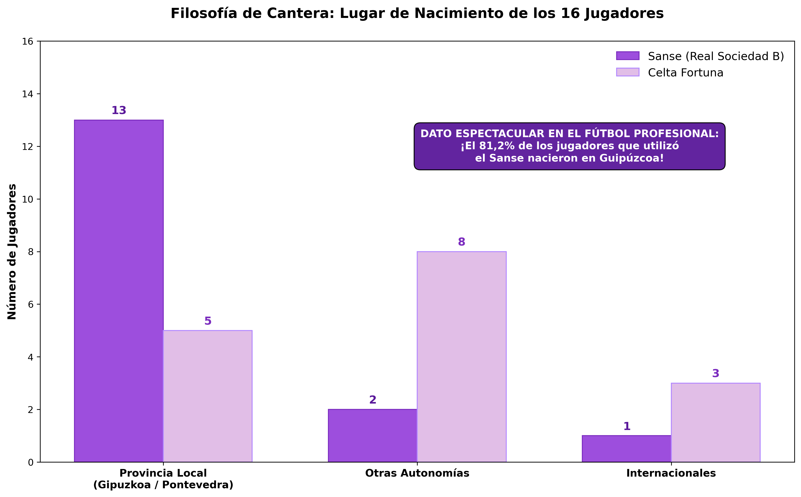

# Comparativa de Canteras: Sanse vs Celta Fortuna 📊⚽

La realidad de los datos del estreno de la temporada en LaLiga HyperMotion nos deja una conclusión espectacular sobre cómo se gestiona el talento joven en la categoría de plata.

Si comparamos cara a cara las convocatorias de los **dos únicos filiales de toda la categoría**, el **Sanse (Real Sociedad B)** and el **Celta Fortuna** —valorando en este análisis única y exclusivamente a los 16 futbolistas por equipo que disputaron minutos en esta primera jornada—, vemos dinámicas que merecen una reflexión.

## 👶 1. La madurez no se negocia
A nivel de edad, las fuerzas están equilibradas. Las medias son muy parecidas: **21,25 años** para el Sanse frente a los **21,88 años** del filial celeste. El dato que demuestra la apuesta radical por la juventud es demoledor: **ninguno de los dos conjuntos tiene a un solo futbolista que supere los 24 años de edad** sobre el césped. Confianza total en bloques que apenas superan la veintena para competir en una división profesional tan exigente.

## 🌍 2. La gran diferencia: Identidad territorial vs. Captación
Donde el gráfico rompe todos los moldes es en el lugar de nacimiento. Mientras que el Celta Fortuna apuesta por un modelo de captación más disperso (combinando 5 futbolistas locales de la provincia de Pontevedra con talento de otras comunidades autónomas e internacionales), lo de la Real Sociedad es un hito de "Km 0" tremendo: 

👉 **¡13 de los 16 jugadores que utilizó el Sanse son nacidos en Guipúzcoa!** Un asombroso 81,2% de la plantilla compitiendo bajo el código postal de su propia casa. De hecho, en el 11 inicial de la Real Sociedad solo 3 futbolistas no eran guipuzcoanos. 

Y el arraigo de estos tres últimos es absoluto: uno de ellos afronta ya su tercera temporada en la casa, el otro supera los tres años de vinculación, y el último, que es internacional, cumple su segunda etapa formativa en el club. Son futbolistas totalmente integrados en la identidad de Zubieta.

## 🎯 Conclusión
En un fútbol profesional donde la inmediatez suele devorar los procesos, ver a un filial competir en Segunda con un bloque local tan sumamente arraigado a su territorio no es fruto de la casualidad ni de una generación espontánea. **El modelo Zubieta es el éxito de un montón de años trabajando de forma ininterrumpida ese modelo de cantera**, con paciencia, metodología y una estructura impecable.
